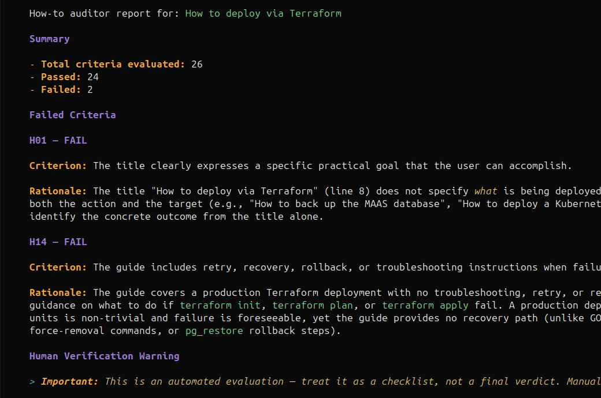

# How-to Auditor



This is the How-to Auditor project from Canonical's Engineering sprint Hackathon at Madrid 2026.

Automated quality checker for How-to guides that verifies a static set of criteria. Uses an LLM to evaluate guides against predefined criteria derived from the Diátaxis framework and other best practices, producing a structured PASS/FAIL report.

Tested and created with Open Code and Open Router, using DeepSeek V4 Pro model.

## What it does

The auditor verifies that a How-to Guide follows best practices — correct structure, actionable language, proper formatting, appropriate scope, and completeness. It leverages LLM reasoning to judge compliance rather than relying on simple pattern matching, allowing it to handle nuance and context.

## Repository structure

```
how-to-auditor/          # LLM skill (self-contained, portable)
├── SKILL.md             # Skill definition with full evaluation protocol
├── README.md            # Skill-specific install and usage docs
└── context/
    ├── how-to-criteria-examples.yaml   # criteria with GOOD/BAD examples
    └── diataxis-howto-summary.md       # Diátaxis How-to Guide summary
```

## How to use

Copy the skill folder into your project skills directory:

```bash
cp -r how-to-auditor .agents/skills/
```

Activate the skill in your tool of choice (e.g. run `opencode` then `/skills` in the folder containing `.agents`).

Then ask the LLM to review a guide — it can access the document via file, prompt input, or remote URL.

See [`how-to-auditor/README.md`](how-to-auditor/README.md) for additional install paths and manual API usage.

## Configuration

| Setting | Value |
|---------|-------|
| Recommended model | DeepSeek v4 Pro |
| Minimum context window | 32K tokens |
| Temperature | 0.0 |
| Interaction mode | Single-turn (stateless) |

## Criteria reference

### Common checks (C01–C10)

Applicable to any Diátaxis document type.

| ID  | Criterion |
|-----|-----------|
| C01 | The document has a valid heading hierarchy, no duplicate top-level titles, and no skipped structural levels. |
| C02 | Terminology, product names, command names, UI labels, and placeholder names are used consistently. |
| C03 | The language is concise, direct, and oriented toward a user who is trying to complete work, not study a topic. |
| C04 | Required commands, configuration snippets, file paths, placeholders, and code blocks are formatted correctly. |
| C05 | Code blocks declare an appropriate language where the documentation format supports it. |
| C06 | Commands, JSON, YAML, Python, shell snippets, or other machine-readable examples are syntactically valid where validation is possible. |
| C07 | Placeholders and example values are understandable, usable, and consistent in the context of the task. |
| C08 | Risky, destructive, security-sensitive, or irreversible actions are explained before the user performs them. |
| C09 | Warning, note, and caution blocks are not too frequent (not more than two per screen) and placed near the relevant steps rather than far away from the action they affect. |
| C10 | Command introductions state the goal directly without redundant phrasing such as "run the following command", "by running the command below", or "execute the following". |

### How-to specific checks (H01–H16)

| ID  | Criterion |
|-----|-----------|
| H01 | The title clearly expresses a specific practical goal that the user can accomplish. |
| H02 | The title and opening paragraph describe the same goal, without shifting scope or introducing a different task. |
| H03 | The guide begins with a clear statement of intent explaining what the user will achieve. |
| H04 | The guide has a recognizable procedural structure, such as numbered steps, action-oriented headings, or clearly ordered sections. |
| H05 | The guide follows a logical sequence from starting condition to completed outcome. |
| H06 | Each major step tells the user what to do, rather than merely describing what is possible. There can be some conditions and branching. |
| H07 | Step text and headings use imperative or action-oriented language where appropriate. |
| H08 | The guide avoids excessive conceptual explanation that would be better placed in explanation documentation. |
| H09 | The guide avoids reference-style content such as long option lists, exhaustive parameter tables, or API descriptions unless directly needed for the task. |
| H10 | The guide identifies necessary prerequisites, assumptions, tools, permissions, or starting conditions. |
| H11 | Branches, alternatives, and optional steps are clearly marked and do not obscure the main path. |
| H12 | The guide reaches the practical outcome promised in the title and introduction. |
| H13 | The guide includes a simple way to verify successful task completion and clearly describes the expected results, outputs, or changed system states for the user to recognize success. |
| H14 | The guide includes retry, recovery, rollback, or troubleshooting instructions when failure is likely or costly. |
| H15 | The guide is appropriately scoped — not too broad, not needing a split into multiple guides. |
| H16 | The guide links to explanation, reference, or tutorial material when necessary, but sparingly to minimise breaking the flow. |
